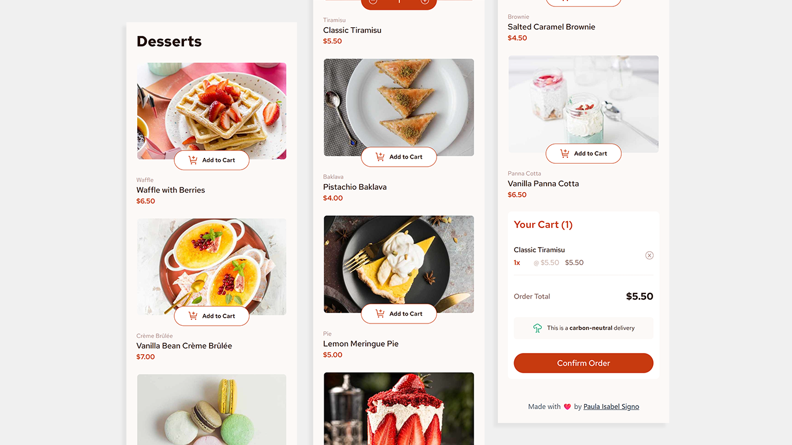

# The Dessert Cart: <a href="https://thedessertcart.vercel.app/" target="_blank">Visit Here</a>

A responsive dessert selection application with a functional shopping cart. Users can browse desserts, manage quantities, and confirm orders—all with real-time UI updates.

## Features

🛒 Add and remove items from the cart
🔢 Adjust item quantities dynamically
✅ View an order confirmation modal
🔄 Reset selections with “Start New Order”
⌨️ Full keyboard navigation support
📱 Optimized layout for all screen sizes

✨ Data populated dynamically from `data.json`

## Built With

- React
- TypeScript
- Sass / SCSS
- Tailwind CSS

## Author

GitHub - [@paulaxisabel](https://github.com/paulaxisabel/)
